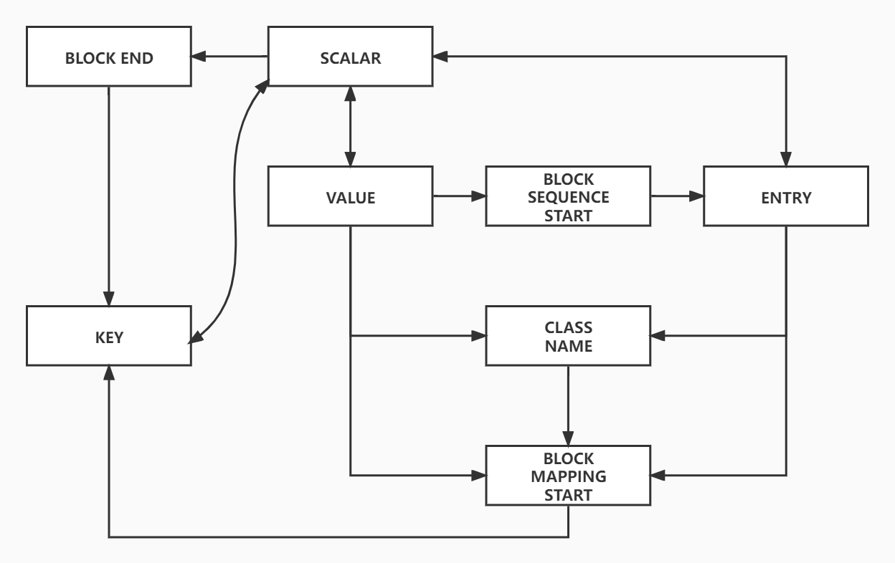

CONSTRAINTS:
KS  -> V         :k-v need value  
VS  -> BE        :block end  
    -> K         :next key  
ES  -> E         :next entry  
    -> BE        :block sequence close  
BE  -> BE        :to BE  
    -> K         :next k-v  
    -> E         :next entry  
    -> SE        :stream end  
V   -> S         :k-v complete  
    -> C         :get sub class name  
    -> BMS       :sub mapping start  
    -> BSS       :sub sequencing start  
C   -> BMS       :sub class start  
BMS -> K         :first k-v  
BSS -> E         :first entry  
E   -> S         :value of entry  
    -> C         :get entry class name  
    -> BMS       :start sub block mapping  

```
com.vaxtomis.yaml4test.Parser EXAMPLE:
<BMS> (push "Map" in)
    <GET_NAME> -> class                 {Map1: class -> !Class}
    <GET_CLASSNAME>
    <BMS> (push "class" in)             {Stack: class}
        <GET_NAME> -> B                 {Map2: B -> !TestPojo.classB, C -> CCC, D -> DDD}
        <GET_CLASSNAME> -> TestPojo.classB
            <BMS> (push "B" in)         {Stack: class, B}
                <GET_NAME> <GET_VALUE>  {Map3: suba -> "!aaa", subb -> bbb}
                <GET_NAME> <GET_VALUE>
            <BME> (pop "B" out) (Inject the map3 into B)
        <GET_NAME> <GET_VALUE>
        <GET_NAME> <GET_VALUE>
    <BMS> (pop "class" out) (Inject the map2 into class)
<BMS>
```
```
com.vaxtomis.yaml4test.Parser EXAMPLE:
<BMS>
    <GET_NAME>
    <BSS>
        <GET_ENTRY (class)>
        <BMS>
            <GET_NAME> <GET_VALUE>
            <GET_NAME> <GET_VALUE>
        <BME>
        <GET_ENTRY (class)>
        <BMS>
            <GET_NAME> <GET_VALUE>
            <GET_NAME> <GET_VALUE>
        <BME>       
    <BSE>
<BME>    

com.vaxtomis.yaml4test.Parser EXAMPLE:
<BMS>
    <GET_NAME>
    <BSS>
        <GET_ENTRY (value)>
        <GET_ENTRY (value)>
    <BSE>
<BMS>
```

deepCopy 时修改对应类实例属性值的两种策略（待定）：  
* 在使用 EventList 生成实例前，对 EventList 进行修改。  
  1. 实现简单
  2. 不用侵入 Producer 类
  3. 需要先定位位置（遍历整个 EventList），开销增多
* 在通过 EventList 生成实例时，通过附加映射去拦截原本的值。
  1. 用映射开销更小（生成实例本身需要遍历 EventList，在其中加入一个查表）
  2. 需要修改 Producer 类的实现